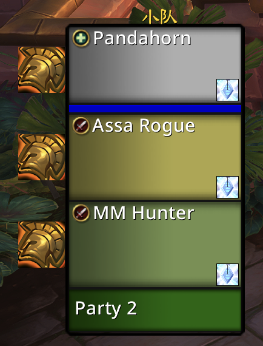
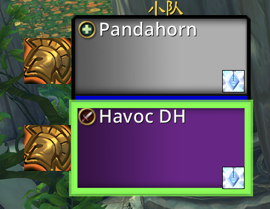
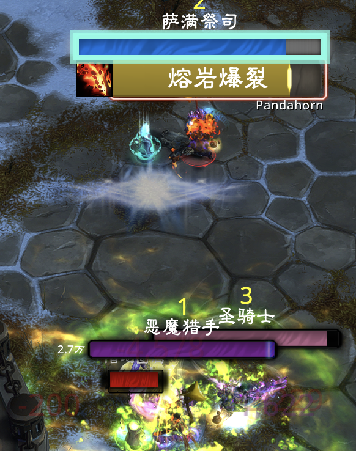
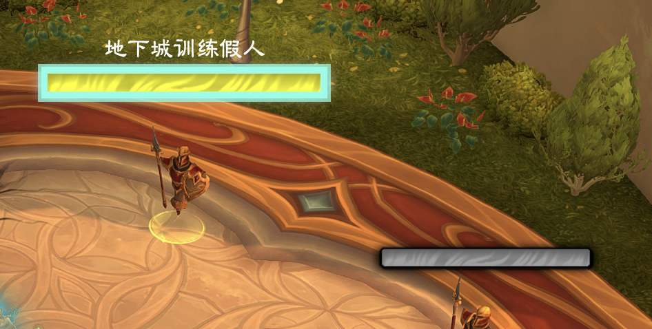

# Pandahorn Gameplay Toolbox

轻量的魔兽世界正式服 PvP 插件：看清队友职业专精，快速找到当前选中的目标。

## 竞技场队友重命名

进入竞技场后，将队友框架和友方目标框架中的姓名替换为职业专精，例如 `Holy Pal`。默认保留自己的名字，离开竞技场后恢复原名。

## 队友框架目标高亮

选中队友时，高亮对应的暴雪小队／团队式小队框架，便于确认当前目标。默认仅在竞技场启用，也可在设置中开启其他场景。

## 姓名板目标高亮

为当前目标的姓名板添加醒目的边框和外发光，适用于敌方和友方目标。可与队友框架高亮独立开关、调整颜色和粗细。

## 安装与设置

将安装包解压到 `World of Warcraft/_retail_/Interface/AddOns/`，确认其中有 `PandahornGameplayToolbox` 文件夹。

游戏内打开 **Esc → Options → AddOns → Pandahorn Gameplay Toolbox**。设置即时生效，可调整开关、姓名格式和高亮样式。

如已安装旧版 `SimplePartyHighlight`，请禁用它以避免重复高亮。
